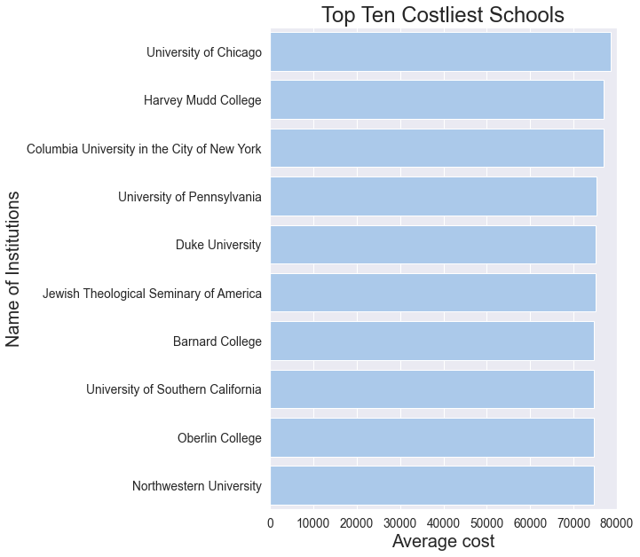
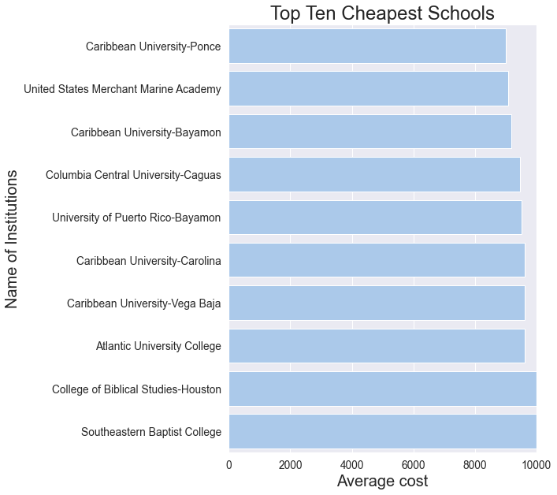
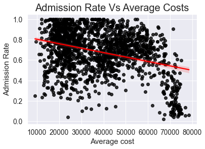
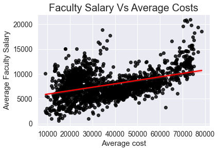
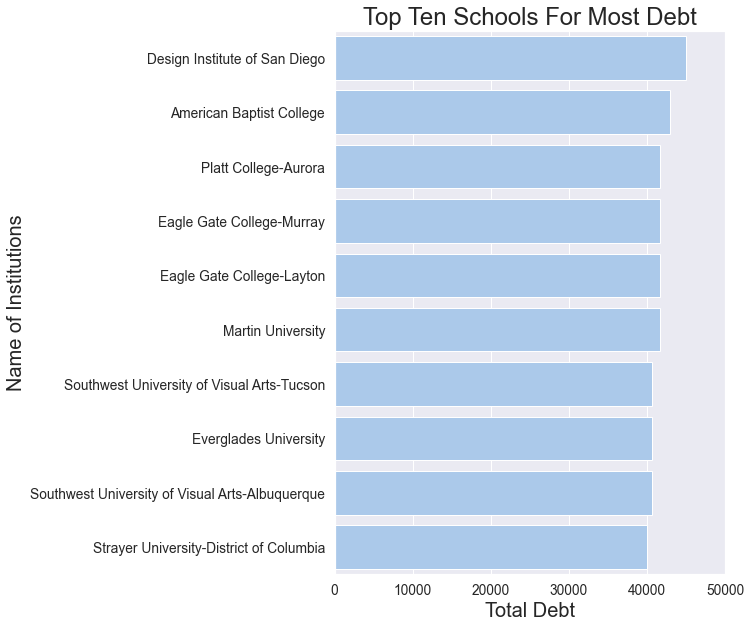
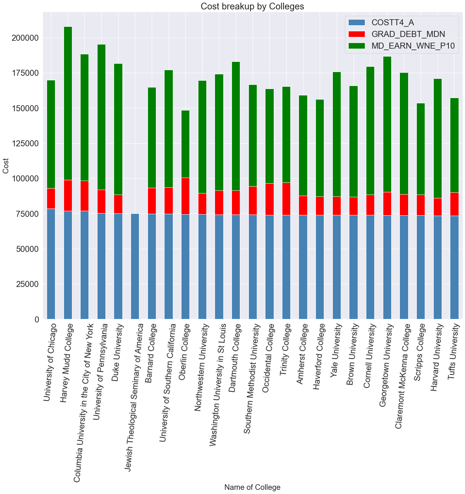

# College Admission Analysis using Predictive Analytics
## Table of Contents
* [Business Problem](#BusinessProblem)
* [Background/History](#Background)
* [Data Explanation](#DataSets)
  * [Files Used](#Files)
* [Methods](#Methods)
* [Analysis](#Analysis)
* [Conclusion](#Conclusion)
* [Limitations](#Limitations)
* [Challenges](#Challenges)
* [Ethical Assessment](#Assessment)
* [References](#References)
* [Questions](#Questions)

### Business Problem / Questions
It is a trend that almost all colleges employ predictive analytics and data analysis as an integral part of the admissions process over the past few years. Using tis college scorecard data I am trying to answer the following questions:
* Based on the data on test scores, cost to attend, size of school and salary which school offers the best education
* Are there certain schools or states where student debt and loan default rates are high compared to earnings?
* Considering diversity, is there a good ratio of male/female, ethnic and racial mix?
* What can we find about the income distribution patterns of the students getting admission?

In this project I am planning to use machine learning to explore data on American colleges to predict post-graduate earnings. There are hundreds of different features that make each college unique, including: location, admission rates, tuition, demographics, average student loans, and average standardized test scores. I want to discover which of these features are most significant in predicting the median ten year post-graduate earnings for a given college.

### Background / History
Higher education is now a massive industry, with 20 million American students enrolled in colleges. 77% of colleges and universities spend over 100,000 per annum on brand strategy work and among those about a third spend over $200,000 per year. This has become a growing trend in higher education. Although most colleges are non-profit but still they employ marketing professionals to reach out to and engage the millions of American college applicants per year. It was released on Sept of 2015. This dataset has been widely used in various news analysis and academic researched. As I was going over those articles, I became interested to see what type of information I can gather from it which could help High School age students looking for colleges and admission.

### Data Explanation
The Dataset was downloaded from the [U.S. Department Of Education][1] website. The [College Scorecard][1] was created in 2013 under President Barack Obama's administration to make data about colleges more accessible to consumers in a centralized, interactive tool

The dataset consists of Instituition-level data files for 1996-97 through 2019-20 containing aggregate data for eac institution. It includes information on institutional characteristics, enrollment, student-aid, cost and student outcomes. The primary purpose of the Scorecard is to provide data to help prospective postsecondary students make informed enrollment decisions.

> #### Files Used
> College Scorecard provides 
> 1. Data files with data about institutions as a whole 
> 2. Data files wit data about specific fields of study within institutions

> * CollegeScorecardDataDictionary.xlsx:
        This excel sheet contains the data dictionary of the various files supplied. I looked at the FieldOfStudy_Data_Dictionary tab to glean through all the available features and chose my required features. The data element descriptions for the different Variable Names used within the data is described in this file. I found the following 4 columns very useful:
    * Name of Data Element
    * Variable Name
    * Value
    * Label
> * Most-Recent-Cohorts-Field-of-Study.csv
        Data files with data about specific fields of study within institutions.
> * Most-Recent-Cohorts-Institution.csv
        Data files with data about institutions as a whole. College Scorecard data files for data elements calculated at the institution-level.
        

### Methods
>   #### Data Set identification
   I am using Jupyterlab and using pandas to view the various datafiles that I ave downloaded from the website. After looking at the files I will decide wich attributes to use in my analysis.
>   #### Reading the available articles 
   This is a nice article that defines the usefulness of tis dataset [snews]. I went through a lot of online articles about this topic and it fascinates me as much I can understand about the college admission process and the internal working of it. Needless to say that do have a daugter who is a Sophomore in high school. So this project is very close to my heart.
>    #### Tools used for this analysis
>   * Tableau for visualization
        I am planning to use tableau to visualize the data and also for Exploratory data analysis.
>   * Jupyterlab for analysis
        

### Analysis
The hypothesis for the study presented here is that a student’s future earnings are maximized by attending the best school they can get into, despite the cost.

A better school has:

> a higher average SAT score for attending students

> more advanced degrees

> high average faculty salaries

> more selective admissions

After collecting and analyzing data from the college scorecard I am in a position to evaluate this hypothesis. I found that institutions with high average faculty salaries and high average SAT scores cost more, but students that attend these schools make more money ten years after leaving the institution. Additionally, schools that offer more advanced degrees, such as bachelors and graduate degrees, produce students that make higher wages. I also found a statistically significant positive correlation between the cost of attending the institution and the median student salary ten years after leaving, indicating that post secondary schooling is a good investment. However, I did not find a strong correlation between admission rate and future earnings, indicating that difficulty of gaining entry to a school should not be a metric when determining where to obtain post secondary schooling.

The below 2 charts show the Top 10 costliest and cheapest schools based on the dataset.

   
#### Figure 1

We next examine the relationship between cost and admission rate, faculty salary and SAT score.

   
#### Figure 2

The first thing that stands out in this plot is the low average salaries that college professors earn. It is possible that many of them are part time? Also, it appears that there are two unique groups in this data. There appears to be a positive linear relationship between AverageCost and FacutlySalary for Institutions with an AverageCost > 20000, and another weaker positive linear relationship between these two features for Average Cost < 20000. In general, we can say that more expensive schools pay their Faculty a higher wage.

In contrast to FacultySalary, we see a relatively weak negative linear relationship between AdmissionRate and AverageCost that seems to be driven by the cluster of institutions with a less than 20% admission rate and cost of greater than 60,000. Assessment of the strength of this relationship could be done by evaluating the p-value of the slope of the regression line, but this is beyond the scope of this EDA.

#### Debt Accrued From Attending College
Another major financial aspect of attending a post secondary school is the debt that often comes with it. Taking on debt can be a wise financial move it the returns are greater, and we will get to this analysis below, but first we explore the debt in this data set. There are two debt features to consider:

> GRAD_DEBT_MDN – median debt of students that completed

> WDRAW_DEBT_MDN – median debt of students that did not complete

First we find the top ten schools where students that finish their schooling have the most debt.

#### Comparing the cost with the Debt and the Median earning 
The below chart shows how the future earnings of the students in the top 25 Colleges by Cost. It shows that in those cases the cost is almost always offset by the earnings.

 

### Conclusion
Now that we have identified the features that are related to the median earnings of students ten years after attending an institution we are in a position to build a supervised regression machine learning model to predict future earnings.

As mentioned above, features that seem to influence future earnings are the following:

> HIGHDEG – Highest degree awarded

> STABBR – the state location of the institution

> COSTT4_A – average cost of attendance

> AVGFACSAL – average faculty salary

> SAT_AVG – average SAT score of students admitted

Two of the features are categorical and three are continuous, and a decision tree model is suited to handing these types of features for regression. Furthermore, we will attempt to improve model performance by employing a gradient boost model. Here we briefly describe **gradient boosting for supervised regression**. The goal of supervised learning is to find a function that maps a set of input features (x) to a desired output response variable (y). We are now in a position to create a gradient boosted decision tree model to predict ten year median earnings.

Overall, the College Scorecard represents a major advance in the effort to transparently compare colleges along dimensions of quality. It’s major limitation is the lack of any value-added metrics. Yet, it makes strides toward allowing college administrators, policy officials, and others responsible for the quality of a college to more readily identify and resolve its weaknesses, with a view to enhancing student well-being after attendance. It also can help make the market for higher education function more efficiently via greater transparency and consumer empowerment. However progress is severely limited by flaws in available data.

### Limitations
1. Incomplete coverage. In the Scorecard’s case, this means the data are limited to federal aid recipients. For Payscale, it means a non-random sample and many institutions with no data. Neither report outcomes for students by graduate institution or program of study.
2. Lack of outcomes data disaggregated by field of study. This is true for all multi-state databases.
3. No measures of learning. Perhaps the serious omission related to data on college quality is the absence of any information about what students learn while in college. While achieving higher earnings are often a secondary goal, acquiring a body of useful or meaningful knowledge is perhaps the chief goal of higher education.
4. It only reports earnings data for students starting as undergraduates who received federal aid—either loans or grants, which applies to roughly half of all students, and federal aid recipients tend to have lower family incomes than their peers. 
5. Moreover, some colleges with multiple campuses report have earnings data only at the system level, not at their specific campuses. This affects roughly 8 percent of students in the Scorecard database.

### Challenges / Issues

- Data quality issues e.g., some sectors had high shares of students with an unknown completion status
- Data suppression in order to protect student privacy
- Data hidden and not available for analysis
- The missing elements were as a result of no compulsory or mandatory clause for reporting and as a result inaccuracy of the report cannot be ruled out.

### Ethical Consideration
College Scorecard still contains flaws that undermine its overall effectiveness.  Among the concerns is the Scorecard’s focus on limited variables, particularly monetary measures of value.  Reducing the measure of an institution’s worth to two or three numeric factors does not present a full or accurate representation of an institution’s mission and character.  The College Scorecard must continue to evolve if it is to be helpful to families, and fair to all institutions, particularly those that serve a high proportion of low-income students. The Scorecard also faced criticism in 2017, when it was revealed that it had been publishing inaccurate loan repayment rates for most colleges. Blaming the blunder on a “coding error,” the Department was quick to fix the mistakes. 
A major bias introduced in this study by the collectors of the data is that the data is limited to students that are Title IV recipients (3). A Title IV award includes government loans and grants (4), and these are need based awards. Thus, it is important to keep in mind that the conclusions we attempt to make using this data set are not general to all students, but rather only those that qualified for, or perhaps more importantly had access to, financial aid.

### References / Acknowledgement

Data Sources used
<!---
I am adding the below links with the subscripts to be refereneced within the document
[1]: https://collegescorecard.ed.gov/data/
[2]: https://www.usnews.com/education/best-colleges/articles/how-us-news-calculated-the-rankings
[3]: https://www.usnews.com/education/best-colleges/paying-for-college/articles/how-students-should-use-new-college-scorecard-data
[4]: https://community.tibco.com/wiki/college-scorecard-analysis
[5]: https://www.kaggle.com/datasets/kaggle/college-scorecard
[6]: https://deepnote.com/@omar-khan/Analysis-of-COLLEGESCORECARD-dataset-VG7JYdzUTDOOFv003pRAVw

--->

1. https://collegescorecard.ed.gov/data/
2. https://www.usnews.com/education/best-colleges/articles/how-us-news-calculated-the-rankings
3. https://www.usnews.com/education/best-colleges/paying-for-college/articles/how-students-should-use-new-college-scorecard-data
4. https://community.tibco.com/wiki/college-scorecard-analysis
5. https://www.kaggle.com/datasets/kaggle/college-scorecard
6. https://deepnote.com/@omar-khan/Analysis-of-COLLEGESCORECARD-dataset-VG7JYdzUTDOOFv003pRAVw

### Questions

1. At four-year colleges, are completion rates improving each year?
2. Are College completion rates increasing for low-income students?
3. Does a better school has better average SAT score for the attending students?
4. Does a better schoolprovide more advanced degress?
5. Does a better school have higher faculty salary?
6. Do better schools have more selective admissions?
7. How many students have access to financial aid?
8. What is the breakup of gender in getting aid?
9. Does gender affect future earnings?
10. Do we see any racial bias in the aid process?